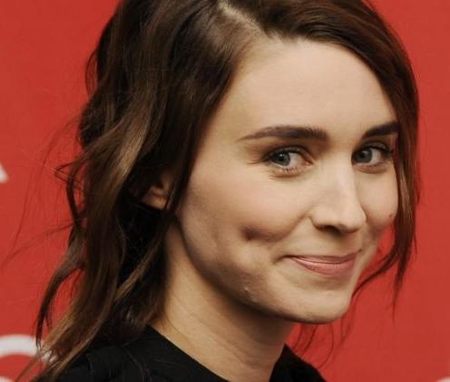

# PyVGGFace 

A [VGG-Face CNN descriptor](http://www.robots.ox.ac.uk/~vgg/software/vgg_face/) implemented in PyTorch. 

The VGG-Face CNN descriptors are computed using [1] authors' CNN implementation, based on the VGG-Very-Deep-16 CNN architecture (see [1]), and are evaluated on the Labeled Faces in the Wild [2] and the YouTube Faces  [3] datasets. The provided models can be used for non-commercial research purposes under  [Creative Commons Attribution License](http://creativecommons.org/licenses/by-nc/4.0/). 

**Step 0**: Setup and activate a virtual environment (Python 3.3+), as follows:

~~~bash
$ python3 -m venv venv
$ source venv/bin/activate
$ pip install --upgrade pip
$ pip install -r requirements.txt
$ source venv/bin/activate
~~~

**Step 1:** Convert the original pre-trained LuaTorch weights into PyTorch VGGFace weights and save them at `models/vggface.pth` by running the following script:

~~~bash
$ python3 convert_weights.py 
~~~

After this step, `models` directory should be as follows:

~~~
models/
├── vggface.pth
├── vgg_face_torch
│   └── VGG_FACE.t7
└── vgg_face_torch.tar.gz
~~~

**Step 2:** Run demo script:

~~~bash
$ python3 demo.py 
~~~

By default, image `data/rm.png` is used (use a different image using `--img=<image_file>`) -- the output should be as follows:

~~~bash
Predicted id: Rooney_Mara (probability: 0.984787964730149)
~~~

**Get VGGFace sub-model**

Use the following script for getting a sub-model of VGGFace, e.g., only the convolutional sub-network, and/or rename its layers:

~~~bash
$ python3 get_submodel.py -h
usage: Get (sub)model of VGGFace model [-h] [--model MODEL] [--output OUTPUT]

optional arguments:
  -h, --help       show this help message and exit
  --model MODEL    input VGGFace model file
  --output OUTPUT  output VGGFace (sub)model file
~~~

------

**References**

[1] Parkhi, Omkar M., Andrea Vedaldi, and Andrew Zisserman. "Deep face recognition." *BMVC*. Vol. 1. No. 3. 2015.

 [2] G. B. Huang, M. Ramesh, T. Berg, E. Learned-Miller Labeled faces in the wild: A database for studying face recognition in unconstrained environments. Technical Report 07-49, University of Massachusetts, Amherst, 2007.                   

 [3] L. Wolf, T. Hassner, I. Maoz "Face Recognition in Unconstrained Videos with Matched Background Similarity." Computer Vision and Pattern Recognition (CVPR), 2011.     

